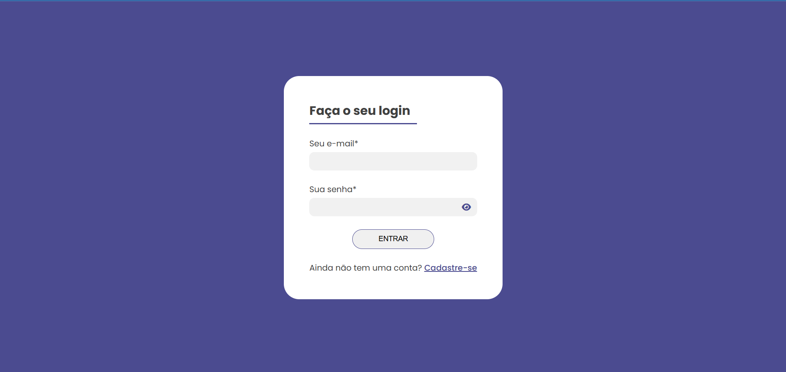
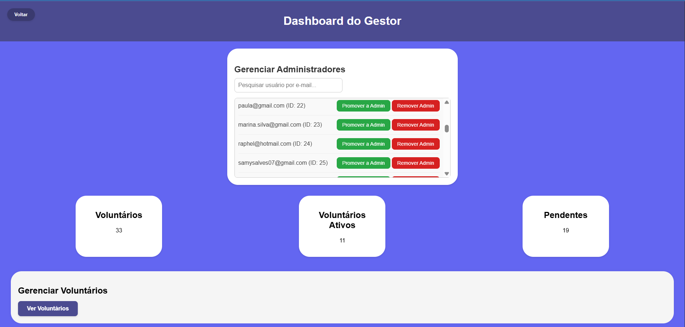

# Projeto DIPCVA

## Propósito do Projeto
O projeto **DIPCVA** foi desenvolvido com o objetivo de facilitar o cadastro e a gestão de voluntários para eventos de acampamento, oferecendo uma solução prática e acessível para organizadores. Voltado para um público específico, o sistema permite o registro de voluntários, controle de informações e comunicação direta, promovendo uma experiência organizada e eficiente. A iniciativa reflete o compromisso com a inovação na educação profissional e tecnológica, buscando atender às demandas do mercado de trabalho com ferramentas tecnológicas úteis e funcionais.

## Tecnologias Utilizadas
- **PHP**: Usado para a lógica do servidor e conexão com o banco de dados.
- **MySQL**: Banco de dados relacional para armazenar informações de voluntários.
- **HTML/CSS/JavaScript**: Estrutura e estilização da interface do usuário, com interatividade básica.
- **XAMPP**: Ambiente local para desenvolvimento e teste do projeto.

## Capturas de Tela

- 
- 
- 
- Veja mais nas [Capturas de tela](capturas_de_tela/)

## Passo a Passo para Testar o Projeto com XAMPP
1. **Instale o XAMPP**:
   - Baixe e instale o XAMPP a partir do site oficial.
   - Certifique-se de que os módulos Apache e MySQL estão ativados.

2. **Configure o Ambiente**:
   - Extraia os arquivos do projeto em uma pasta dentro do diretório `htdocs` do XAMPP (ex.: `C:\xampp\htdocs\AcampaFácil`).
   - Abra o painel de controle do XAMPP e inicie os serviços Apache e MySQL.

3. **Crie o Banco de Dados**:
   - Acesse o phpMyAdmin usando um navegador.
   - Crie um novo banco de dados chamado `acampafacil_db`.
   - Importe o arquivo `.sql` fornecido no projeto (se disponível) para criar as tabelas necessárias.

4. **Configure a Conexão**:
   - Edite o arquivo `conexao.php` no projeto, ajustando as credenciais do banco (host, usuário, senha, nome do banco) para corresponder ao seu ambiente local (ex.: `localhost`, `root`, sem senha).

5. **Teste o Projeto**:
   - Abra o navegador e acesse `http://localhost/AcampaFácil`.
   - Siga as interfaces para cadastrar voluntários, visualizar listas ou realizar outras funcionalidades implementadas.
   - Verifique se os dados são salvos e exibidos corretamente no banco.

## Desempenho no Desafio
O projeto **AcampaFácil** conquistou o **2º lugar** no **Desafio da Educação Profissional e Tecnológica do Paraná 2025**, destacando-se pela inovação e aplicabilidade prática. A solução foi reconhecida por sua abordagem sustentável e funcionalidade, oferecendo uma ferramenta que atende às necessidades reais de organização de eventos. O sucesso reflete o esforço da equipe, que combinou habilidades técnicas com criatividade, competindo com mais de 400 projetos de instituições de todo o Brasil durante a 4ª Semana Nacional de Educação Profissional e Tecnológica (SNETP), realizada em Brasília.

